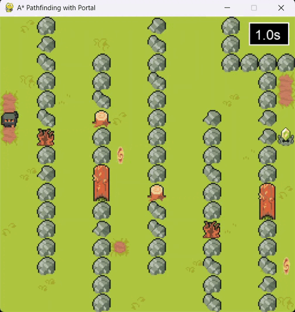
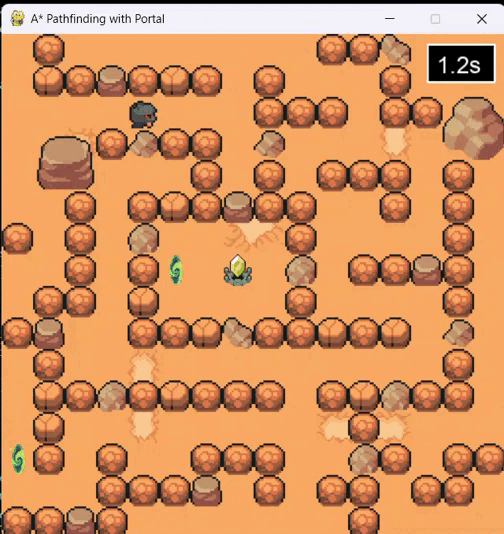
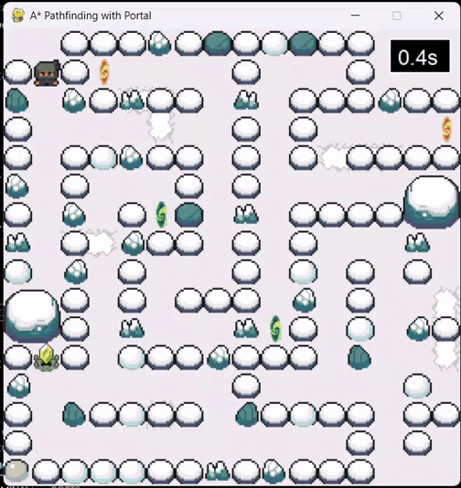

Map: 

Easy: 

Medium: 

Hard: 

A maze-solving game built with Pygame that uses A* pathfinding algorithm. The game features manual and auto play modes with 3 difficulties.

After download, change directory in .tsx files to run the game.

Assets used: https://pixel-boy.itch.io/ninja-adventure-asset-pack
