###BÁO CÁO TRÒ CHƠI PORTAL

##MỞ ĐẦU

#1.	Phát biểu bài toán

Trò chơi Portal là một đồ án lập trình phát triển một ứng dụng game tìm đường (pathfinding) tích hợp cổng dịch chuyển sử dụng ngôn ngữ Python và thư viện Pygame, minh họa ứng dụng trí tuệ nhân tạo trong bài toán tìm đường ngắn nhất.

Bài toán đặt ra yêu cầu xây dựng một giao diện menu thân thiện cho phép người chơi chọn ba mức độ khó (Easy, Normal, Hard), bắt đầu trò chơi, hoặc thoát, đồng thời hiển thị một mê cung 2D nơi các thuật toán tự động tìm đường từ điểm bắt đầu đến đích, hỗ trợ các cổng dịch chuyển (portal) kết hợp với sự hỗ trợ mạnh mẽ từ heuristic, với heuristic sẽ hỗ trợ các thuật toán tìm đường đi với chi phí ngắn nhất và tối ưu hơn.

Portal không chỉ tìm đường bằng thuật toán A*, ngoài thuật toán A* ra Portal còn sử dụng nhiều thuật toán hỗ trợ tìm đường khác như: IDA*, Greedy, BFS.

#2.	Mục đích, yêu cầu cần thực hiện

-	Mục đích cần thực hiện:

Mục đích của dự án là tạo ra một trò chơi trực quan, dễ sử dụng, dễ điều khiển giúp người chơi hiểu rõ hơn về từng thuật toán tìm đường , hiểu hơn về cách AI hoạt động, đồng thời dự án được tạo ra giúp những người dùng đang theo học lập trình game phát triển kỹ năng lập trình game.

-	Yêu cầu cần thực hiện:

Yêu cầu cụ thể bao gồm thiết kế menu với hiệu ứng tương tác, đảm bảo chọn độ khó, chế độ và chọn thuật toán tìm đường trước khi bắt đầu. Từng bản đồ sẽ hiện ra với từng độ khó tương thích khi bắt đầu chạy trò chơi. Trò chơi Portal đáp ứng được yêu những yêu cầu cơ bản nhất là tạo giao diện thân thiện với người dùng, dễ điều khiển trò chơi hơn, và cuối cùng là đáp ứng được yêu cầu quan trọng nhất là áp dụng từng nhóm thuật toán vào trong trò chơi Portal như các thuật toán tìm kiếm có thông tin.

#3.	Phạm vi và đối tượng

-	Phạm vi:

Phạm vi dự án tập trung vào chạy trên máy tính với ngôn ngữ lập trình Python trên nhiều công cụ lập trình khác nhau có thể sử dụng được ngôn ngữ lập trình Python như là Pycharms hoặc visual studio code, đều đáp ứng được nhu cầu lập trình củ người dùng. Ngoài ra, phạm vi thực hiện đồ án còn bị giới hạn bởi từng nhóm thuật toán khi áp dụng vào trò chơi Portal với mịch tiêu cuối cùng là giúp sinh viên hiểu rõ hơn bản chất của từng thuật toán khi áp dụng vào trò chơi Portal này.

-	Đối tượng:

Đối tượng được hướng đến là sinh viên học về AI, lập trình game, những người theo hướng học lập trình AI hay lập trình game, hoặc những người chơi muốn trải nghiệm ứng dụng AI đơn giản. Dự án không những điều khiển được phím nhân vật trong trò chơi bằng phím các mũi tên, mà còn tích hợp thêm chế độ “auto” – AI tự chạy bằng cách tìm đường của từng thuật toán được áp dụng vào trong trò chơi. Từ đó giúp những đối tượng trên hiểu hơn về mục đích mà dự án mang tới.

##PHÂN TÍCH VÀ THIẾT KẾ GIẢI PHÁP

#1. Sơ đồ khối và ý tưởng thuật toán

1.1. Sơ đồ khối
 
  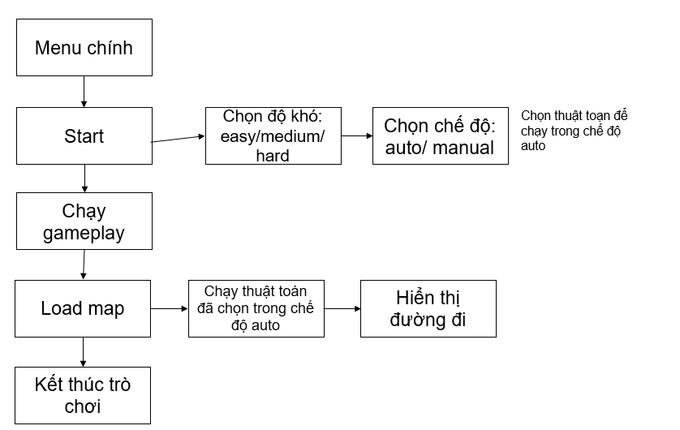

1.2. Ý tưởng thuật toán

Thuật toán A* là một phương pháp tìm kiếm có thông tin (informed search) được sử dụng trong game Portal để tìm đường ngắn nhất từ điểm bắt đầu đến đích trong mê cung 2D, đồng thời xử lý các cổng dịch chuyển (portal) một cách hiệu quả. Cũng như A* là một trong những thuật toán nằm trong nhóm thuật toán tìm kiém có thông tin (informed search), thuật toán IDA*, Greedy cũng được áp dụng vào trong game Portal – tìm đường đi từ điểm bắt đầu đến điểm cuối là đích. Ngoài áp dụng các thuật toán có trong tìm kiếm có thông tin, thì nhóm chúng em còn sử dụng thêm thuật toán tìm kiếm không có thông tin là BFS - là một trong nhóm các thuật toán tìm kiếm không có thông tin, BFS dựa trên phương pháp ttimf đường “mù” - duyệt tất cả các đường đi để tìm đến đích đến cuối cùng.

#2. Chi tiết về các thuật toán đã sử dụng

Breadth First Search (BFS) chạy theo từng lớp bước, đảm bảo tìm ra con đường ít bước nhất, nhưng lại tiêu tốn rất nhiều bộ nhớ khi mê cung phức tạp. Ngược lại, Greedy Best First Search chỉ quan tâm đến khoảng cách ước lượng đến đích, nên di chuyển rất nhanh những dễ bị “sa lầy” vào đường cụt và không đảm bảo tối ưu về độ dài đường đi. A* là điểm cân bằng giữa hai phương pháp trên: nó kết hợp chi phí đã đi (g) và chi phí ước lượng còn lại (h) thành f = g + h, từ đó vừa giữ tốc độ lọc bỏ các nhánh vô ích, vừa đảm bảo tìm được đường ngắn nhất nếu heuristic hợp lệ. Nhược điểm duy nhất của A* là cần nhiều bộ nhớ để lưu hàng đợi các ô chờ xử lý. Để khắc phục hạn chế này, IDA* áp dụng chiến lược tìm kiếm theo chiều sâu với ngưỡng f tăng dần: mỗi lần chạy, thuật toán chỉ tiếp tục xuống sâu với những ô có f không vượt quá giới hạn, giúp tiết kiệm bộ nhớ đáng kể dù phải lặp lại nhiều lần. 

Hàm heuristic h(n) sử dụng khoảng cách Manhattan (tổng chênh lệch tọa độ x và y) để ước lượng chi phí đến đích, đảm bảo tính tối ưu và hiệu quả. Đặc biệt, khi gặp ô portal , A* thực hiện nhảy tức thời đến ô portal liên kết, cho phép thuật toán xử lý các đường đi phi tuyến tính. Quá trình lặp tiếp tục cho đến khi đến đích, sau đó truy vết ngược để tạo danh sách các ô thuộc đường đi ngắn nhất. Thuật toán A* không chỉ đảm bảo tìm được đường đi tối ưu mà còn đủ linh hoạt để xử lý các mê cung phức tạp với portal, phù hợp với ba mức độ khó (Easy, Medium, Hard) của game.

##THỰC NGHIỆM, ĐÁNH GIÁ VÀ PHÂN TÍCH KẾT QUẢ

#1. giới thiệu giao diện, hướng dẫn thực thi phần mềm.

Portal – là một dạng trò chơi thoát khỏi mê cung, nhưng trong Portal này còn có tính năng hỗ trợ giúp người chơi tìm đường nhanh hơn là cổng dịch chuyển, và mục tiêu cuối cùng của chúng ta là đích đến cuối cùng.

-	Giao diện menu ban đầu:
 
 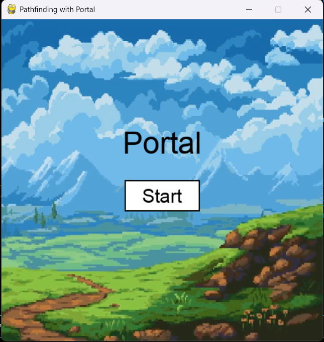

-	Khi nhấn nút start sẽ hiển thị 3 chế độ chơi và chọn mode auto/manual:
 
 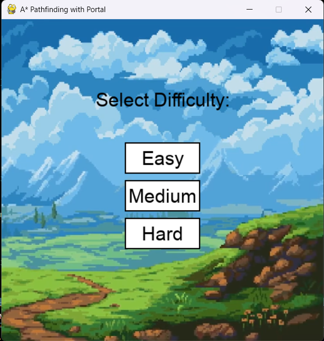
 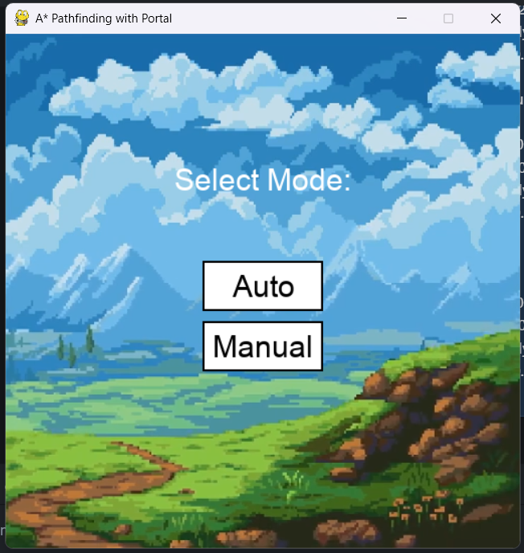

-	Ngoài ra, trong chế độ auto ta có thể chọn chạy một trong bốn thuật toán tìm đường mà ta muốn.

 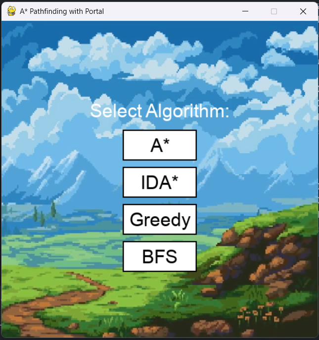

-	Trong mode manual sẽ được điều khiển bằng phím mũi tên trên keyboard.

-	Map easy:

  

-	Map medium:

 

-	Map hard:

 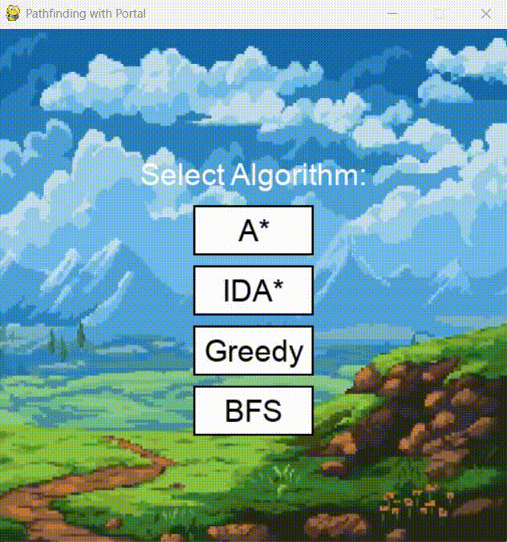

-	Khi đến đích và màn hình hiển thi rằng đã thắng: 

 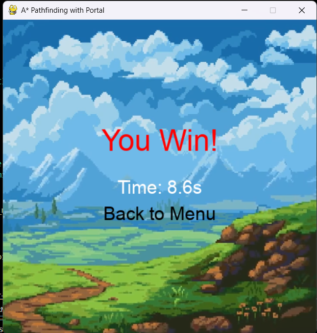

#2.Kết quả thử nghiệm.

  Chương trình đã đạt được mục tiêu cơ bản của một ứng dụng trò chơi cơ bản. Trò chơi cho phép người dùng thao tác trên bàn phím trong chế độ manual (nút mũi tên hướng lên, xuống, sang trái, phải) và cung cấp nhiều bản đồ khác nhau. Các tính năng như cho chạy auto hay người chơi điều khiển (manual) đều hoạt động tốt.

#So sánh hiệu suất giữa các thuật toán

Tại map easy:

 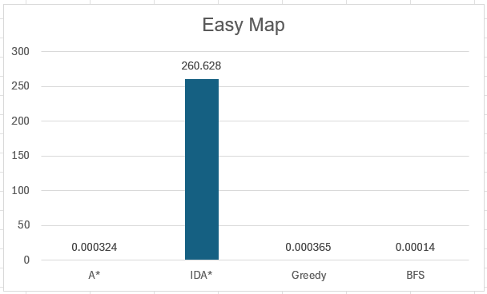
 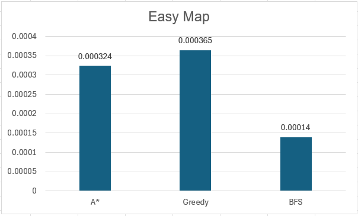
 
Tại map medium:

 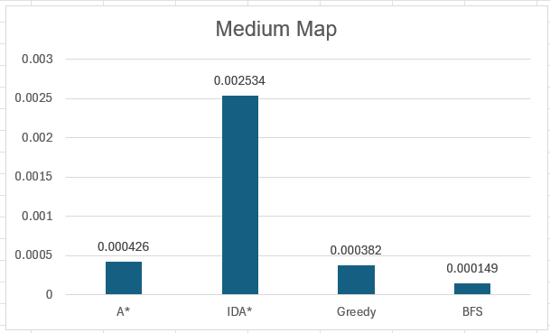
 
Tại map easy:

 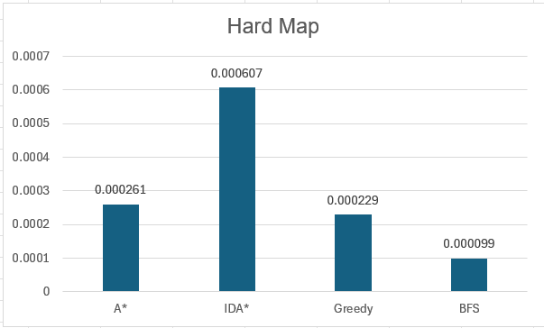

Từ các sơ đồ trên, ta thấy trong cả ba bản đồ, BFS consistently là thuật toán có thời gian thực thi nhanh nhất, trong khi IDA tỏ ra kém hiệu quả về thời gian*, đặc biệt rõ ràng ở bản đồ Easy. Các thuật toán A* và Greedy có thời gian xử lý gần tương đương nhau và thường nằm ở mức trung bình. IDA* cực chậm trên map Easy vì đối với thuật toán, bản đồ có nhiều ngõ cụt và nhiều vật cản, cổng dịch chuyển khó tiếp cận, nên phải tăng threshold nhiều lần, dẫn đến rất nhiều lần duyệt lại toàn bộ không gian tìm kiếm, đặc biệt với DFS.

Assets used: 

https://pixel-boy.itch.io/ninja-adventure-asset-pack

https://pixelnauta.itch.io/pixel-dimensional-portal-32x32
